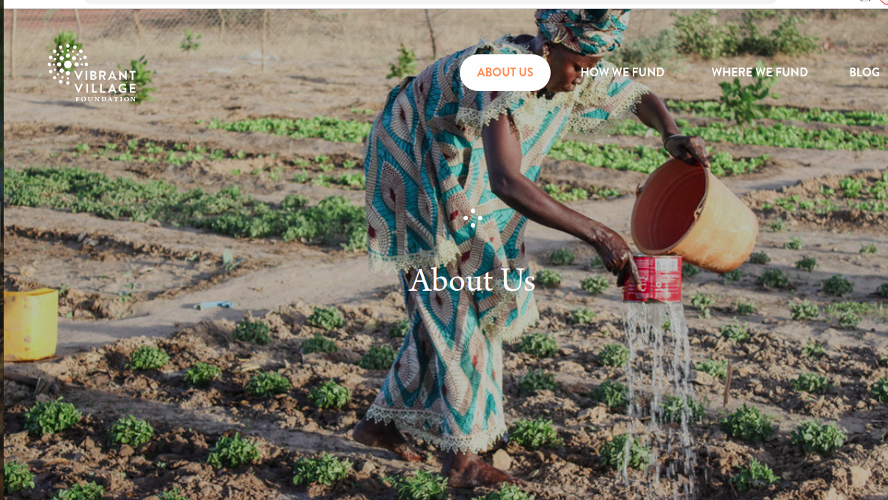
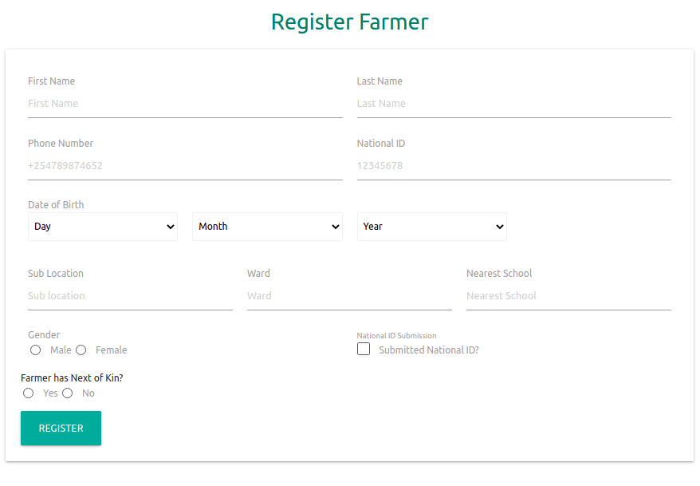
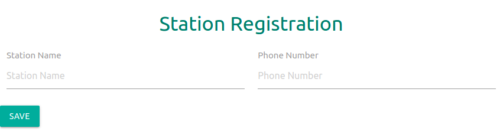
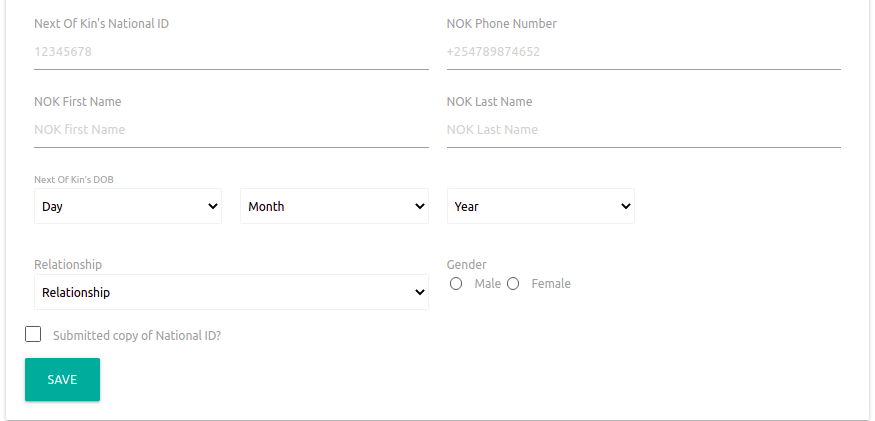
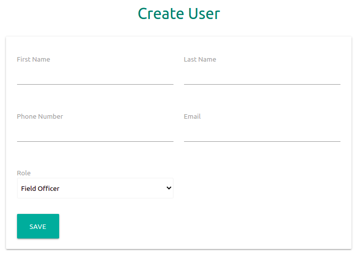
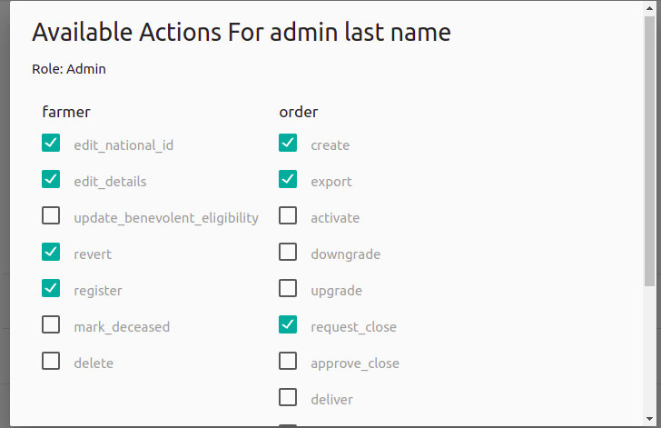

# VIBRANT VILLAGE FOUNDATION

> Vibrant village Foundation is an organization based in Portland, Oregon and USA, it provide grunds for  community based projects that aims to elevate familie's living standards by improving food security, family health, financial wellbeing and education.

In kenya, Vibrant Village Foundation works with a community based in Western who are majorly farmers. Farming being one of the economic activities in the area, the organization invested in empowering farmers through quality seeds, fartelizers and farm tools. To manage all these resources, there was a need to centralize control and monitor the progress of these products, leading to development of Vibrant Village Foundation Portal.

## Built With

- Major languages: Elixir
- Frameworks: Phoenix, PhoenixLiveView, MaterializeCss
- Technologies used: web technologies(HTML, CSS and JS)

## Live Demo

[Live Demo Link](working-of-the-system.gif) #screen recording of how the app works

## Getting Started

**This is an example of how you may give instructions on setting up your project locally.**
**Modify this file to match your project, remove sections that don't apply. For example: delete the testing section if the currect project doesn't require testing.**

To get a local copy up and running follow these simple example steps.

### Prerequisites

- Elixir 1.12.1
- Erlang/OTP 24
- nodejs > 12 LTS
- PostgreSQL 12.7 
- Hex, Elixir's package manager

### Install
- Clone the project using `git clone url`
- For elixir and phoenix development environment use [the phoenix installation guide](https://hexdocs.pm/phoenix/installation.html#content) to ensure everything is setup as expected.

### Setup
**Start Server**

To run your phoenix server:

* Run `mix deps.get` to fetch and install dependecies.
* Run seeds, create and migrate your database with `mix ecto.setup`
* Install Node.js dependecies with `npm install` inside the `assests` directory.
* Start all your application endpoints with `mix phx.server`

Now visit `http://localhost:4000/farming` from your browser to visit the login page.

Use these credentials to login:
* Email: `admin@gmail.com`
* Password: `admin`

### Usage
**Farmer registration**

Farmer can be registered through the following channels:
- Kobo.
- SMS.
- USSD.
- Web.

**SMS**
The farmer is asked a series of questions that they need to answer. All these data is temporarily stored in database table which is then transfered to the main farmers table upon completion.

**Technical steps**

| Step | Description|
| -----| -----------|
|1     |Welcome farmer and ask  for the farmer national id|
|2     |Ask for the names|
|3     |The year of birth|
|4     |Their phone number|
|

A farmer who initiates registration process is automatically at `step0` of registration. When they resume the process, question for `step1` will be asked. This means that the questions we ask the farmer is always  a step a head of the step we have in the database.

**KOBO**

[KoBoToolbox](https://support.kobotoolbox.org/new_form.html) is a free and open source software that is used for field data collection. The field officers use the kobo forms to collect farmer data which are later transmitted to Vibrant repo via a webhook.

The data can be collected while the devices are offline and be transmitted once the device get connected to the internet.

**koBo farmer registration form format**
- farmer name as it appearson the id card.
- farmer year of birth.
- national id.
- farmer's nearest school.
- phone number.
- sublocation.
- please take gps of home if possible .
- farmer gender.
- deviceId.
- group leader Id.
- nok name.
- nok id.
- nok gender.
- realationship 
- nok year of birth.

The form ensure data integrity rules are adhered to which reduces errors leading to better quality data.

**WEB**

Registered farmers can be divided into stations based on locality and groupes according to  shared interest. A farmer's next of kin details are also captured to determine inheritance rights if a person dies. Farmers index page can display all farmers on variation of options, such as : qualified, non-qualified, sales group, groupless and registered farmers.

This page shows the details required to register a farmer.

**Station Registration**

Stations are formed from farmers living within demacated geograohical area, headed by a particular farmer. The page below shows the details needed to register a station.

**Next of Kin Registration**

In Kenya next of kin is a person's closest living relative who can be contacted incase of any enventuality. This person can be registered during farmer registration on the `farmer registration` form, or added to an existing farmer on the `farmer edit` form. Different types of relationship that exist between a farmer and NOK are captured on a `Nok Relationships` form and populated during farmer registration. Once registered all NOks can be viewed on the Nok of kins tab.

**System Users**

These are people with their own user name and password granted access to perform an organization tasks within a system. Vibrant have five levels of users, super admin, admin, field officer and intern, with super admin having the highest preveleges. Below is the form used to create users.

Role management or user access control is implemented in two ways: Through plugs and pipelines and data base role designation.  All users page contain options to edit details, activate/deactive, show user actions and submitted payments for field officers. Show user actions button display a  modal indicating actions for a particular resource(e.g farmer, order).

## ORDERS
These are the individual farm commodities that a registered farmer can order and pay back the due amount within a stepulated time. The available order types include:
- Package.
- Individual Items.
- Top up.
- Short rain.

Order creation process through the web i.e vibrant application inolves a serries of steps.

|step|Description|
|----|-----------|
|1   |Choose a registered active farmer|
|2   |Select the type of order|
|3   |Add discount(optional)  |
|4   |Click creat order|

The different type of orders have different ways of creating them.
**Package type**

|step| Description|
|----|------------|
|1   |Select type of order(package)|
|2   |Select a package(seed and other packages)|
|3   |Seed packages(1 seed, 2 seed e.t.c)|
|4   |Select main seed|
|5   |Select extra seed|
|6   |back to step three of order creation|

For the remaining order types you are presented with a search bar that populates all the available order types and option to specify the number of bags needed. The search is matched according to the names.

**Package Type and Products**

Products are individual items which can be ordered. They are specified into different categories: maize seed, other fertilizer, other items, planting fertilizer, and top dressing fertilizer. On the other hand packages are bundles of these indidivual products.e.g one seed package contains: 1 seed, 1 Dap(10)kg, 2 Can(10)kg, Benevolent Fund, Sukuma(10)g.   

## PAYMENTS
* Super admin
    - 
* Admin
    - 
* Field Officer
    -
* Intern
    -

### Run tests

### Deployment

## Authors

👤 **FRANK MIDIGO**

- Github: [@githubhandle](https://github.com/MidigoF)
- Twitter: [@twitterhandle](https://twitter.com/midigo_frank)
- Linkedin: [linkedin](https://www.linkedin.com/in/midigo-f-023450123/)

👤 **POLLET OBUYA**

- Github: [@githubhandle](https://github.com/githubhandle)
- Twitter: [@twitterhandle](https://twitter.com/P_Obuya)
- Linkedin: [linkedin](https://www.linkedin.com/in/pollet-obuya-664436127/)

👤 **SIGU MAGWA**
- Github: [@githubhandle](https://github.com/sigu)
- Twitter: [@twitterhandle](https://twitter.com/s_igu)
- Linkedin: [linkedin](https://www.linkedin.com/in/sigu/)

👤 ****

## 🤝 Contributing

We use [semantic version](https://semver.org/)to keep track of the application builds.

## Issue tracking
We create user stories in Jira and link them up on Trello. Check vibrant [Trello board](https://trello.com/b/8dQkIYUt/vibrant-tasks) indicating how we track issues from `To Do` to `staging`. 

Contributions, issues and feature requests are welcome!

Feel free to check the [issues page](issues/).

## Show your support

Give a ⭐️ if you like this project!

## Acknowledgments

- Hat tip to anyone whose code was used
- Inspiration
- etc

## 📝 License

This project is [MIT](lic.url) licensed.
